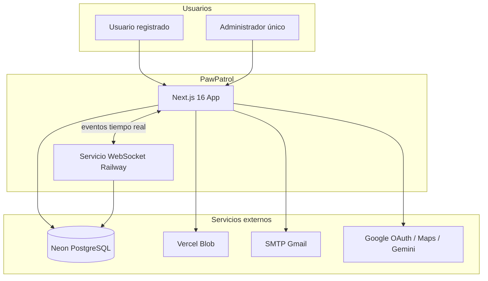
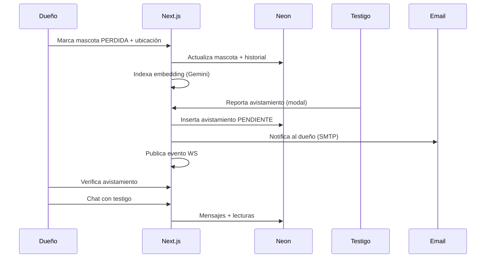
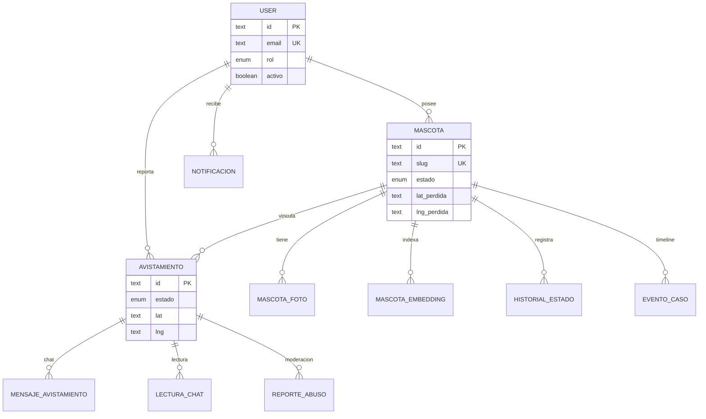

# Documentación del Sistema — PawPatrol (PAWPATROLL)

**Versión:** 1.0 · **Fecha:** junio 2026
**Autores:** Branly Smith Paucar Arias
| Lenin Smith Apaza Cuentas  |
Geremi Armando Venegas Dueñas | 
Fernando Jose Mamani Machaca  |  
Eddy Kennedy Mamani Hallasi
**Demo:** [pawpatroll.vercel.app](https://pawpatroll.vercel.app)
**Repositorio:** [github.com/Smith2207/PAWPATROLL](https://github.com/Smith2207/PAWPATROLL)

> Documento elaborado según la estructura académica de *Documentación del Sistema* (versión concisa).
> Referencia técnica ampliada de módulos: [README-MODULOS.md](../README-MODULOS.md).

---

## Índice

1. [Documentación estratégica](#1-documentación-estratégica)
2. [Arquitectura](#2-arquitectura)
3. [Diseño detallado](#3-diseño-detallado)
4. [Base de datos](#4-base-de-datos)
5. [Documentación de API](#5-documentación-de-api)
6. [Implementación](#6-implementación)
7. [Convenciones de código](#7-convenciones-de-código)
8. [Plan de pruebas](#8-plan-de-pruebas)
9. [Seguridad](#9-seguridad)
10. [Operación y mantenimiento](#10-operación-y-mantenimiento)
11. [Versionado y cambios](#11-versionado-y-cambios)
12. [Checklist de completitud](#12-checklist-de-completitud)

---

## 1. Documentación estratégica

### 1.1 Visión

**PawPatrol** es una plataforma web comunitaria donde los usuarios registrados crean fichas de mascotas, reportan pérdidas y avistamientos, y se coordinan por mapa y chat. Integra búsqueda visual por foto con IA, predicción de comportamiento animal y tiempo (casi) real.

### 1.2 Modelo de actores (lógica del sistema)

> Detalle ampliado: [MODELO-ACTORES-Y-PERMISOS.md](./MODELO-ACTORES-Y-PERMISOS.md)

El sistema usa **dos niveles** que no deben confundirse:

| Nivel                           | Qué es                  | Valores                        |
| ------------------------------- | ------------------------ | ------------------------------ |
| **Cuenta** (`user.rol`) | Tipo de login en la BD   | `USUARIO`, `ADMINISTRADOR` |
| **Caso / chat**           | Papel en un avistamiento | Dueño, Testigo                |

- **USUARIO:** todos los registrados con las mismas funciones (fichas, pérdidas, avistamientos, chat).
- **ADMINISTRADOR:** único soporte; acceso a `/admin`.
- **Dueño:** quien tiene la ficha (`mascota.user_id`) — perdió la mascota en ese caso.
- **Testigo:** quien reportó el avistamiento (`avistamiento.user_id`).

Un mismo USUARIO puede ser dueño en un caso y testigo en otro. Los permisos de verificar avistamientos o editar fichas dependen de **propiedad del registro**, no del rol de cuenta.

### 1.3 Alcance

| Dentro del alcance                                                              | Fuera del alcance (v1)                      |
| ------------------------------------------------------------------------------- | ------------------------------------------- |
| Registro, login (correo + Google), verificación y recuperación de contraseña | App móvil nativa (iOS/Android)             |
| Fichas digitales de mascotas con fotos y estados del ciclo de vida              | Pagos, seguros o marketplace                |
| Reporte público de pérdidas y avistamientos con geolocalización              | Alertas masivas SMS/push a radio GPS        |
| Mapa comunitario (Leaflet) con cercos, calor y refugios                         | Moderación automática de contenido con IA |
| Búsqueda por foto (Gemini Embedding 768d; respaldo CLIP)                       | Integración con refugios municipales       |
| Panel predictivo M5 (radio, zonas refugio, consejos)                            |                                             |
| Chat 1:1 por avistamiento, notificaciones in-app                                |                                             |
| Panel administrativo (estadísticas, export CSV, moderación)                   |                                             |

### 1.4 Requerimientos funcionales (RF)

| ID    | Requerimiento                                                                        | Módulo |
| ----- | ------------------------------------------------------------------------------------ | ------- |
| RF-01 | El usuario puede registrarse con correo/contraseña o Google OAuth                   | M1      |
| RF-02 | El sistema envía correo de verificación y bienvenida                               | M1      |
| RF-03 | El usuario puede recuperar contraseña por enlace temporal (1 h)                     | M1      |
| RF-04 | El usuario puede crear, editar y eliminar fichas de mascotas (hasta 5 fotos)         | M2      |
| RF-05 | El usuario puede cambiar el estado: EN_CASA → PERDIDA → ENCONTRADA → REUNIDA      | M2      |
| RF-06 | La ficha pública es accesible por slug cuando está PERDIDA o ENCONTRADA            | M2      |
| RF-07 | Cualquier visitante puede reportar avistamiento con ubicación y foto opcional       | M6      |
| RF-08 | El dueño recibe notificación (in-app y correo si SMTP) al nuevo avistamiento       | M6      |
| RF-09 | El dueño puede verificar o descartar avistamientos                                  | M6      |
| RF-10 | Existe chat privado dueño ↔ testigo por cada avistamiento                          | M6      |
| RF-11 | El mapa muestra casos activos, avistamientos y capas de comportamiento               | M4, M5  |
| RF-12 | El sistema predice radio de búsqueda, zonas refugio y consejos según perfil animal | M5      |
| RF-13 | El visitante puede buscar mascotas similares subiendo una foto                       | M3      |
| RF-14 | El administrador accede a `/admin`, exporta datos y modera reportes de abuso       | M7      |
| RF-15 | El mapa y el chat se actualizan en tiempo real (WebSocket local o Railway)           | M6      |

### 1.5 Requerimientos no funcionales (RNF)

| ID     | Requerimiento  | Criterio                                                          |
| ------ | -------------- | ----------------------------------------------------------------- |
| RNF-01 | Disponibilidad | Despliegue en Vercel + Neon (SLA del proveedor)                   |
| RNF-02 | Rendimiento    | Páginas públicas < 3 s en 4G; APIs geo con caché               |
| RNF-03 | Seguridad      | Contraseñas bcrypt; sesión JWT; rutas protegidas por middleware |
| RNF-04 | Escalabilidad  | Serverless (Vercel); BD pooled (Neon); Blob para archivos         |
| RNF-05 | Usabilidad     | UI responsive; modales globales; textos en español (Perú)       |
| RNF-06 | Mantenibilidad | TypeScript estricto; módulos M1–M7 documentados                 |
| RNF-07 | Portabilidad   | Node.js 20+; variables por entorno (`.env.local`)               |
| RNF-08 | Privacidad     | Adjuntos de chat privados en Blob; tokens firmados para WS        |

### 1.6 Matriz de trazabilidad (resumen)

| RF        | Componente principal                    | Tablas BD                                                    |
| --------- | --------------------------------------- | ------------------------------------------------------------ |
| RF-01–03 | `autenticacion.ts`, Auth.js           | `user`, `account`, `session`, `verificationToken`    |
| RF-04–06 | `mascotas/*`                          | `mascota`, `mascota_foto`, `historial_estado_mascota`  |
| RF-07–10 | `avistamientos.ts`, `casos/chat.ts` | `avistamiento`, `mensaje_avistamiento`, `lectura_chat` |
| RF-11     | `mapa.ts`, `MapaPawPatrol.tsx`      | `mascota`, `avistamiento`                                |
| RF-12     | `comportamiento/prediccion.ts`        | `mascota`, `avistamiento`                                |
| RF-13     | `api/ia/*`, `indice-visual.ts`      | `mascota_embedding`                                        |
| RF-14     | `admin.ts`                            | todas (lectura)                                              |
| RF-15     | `tiempo-real/*`, `pawpatroll-ws`    | —                                                           |

---

## 2. Arquitectura

### 2.1 Vista de contexto (C4 — Nivel 1)



### 2.2 Vista lógica (capas)

| Capa              | Responsabilidad                                          | Ubicación                         |
| ----------------- | -------------------------------------------------------- | ---------------------------------- |
| Presentación     | Páginas, componentes React, modales, mapa Leaflet       | `src/app/`, `src/componentes/` |
| Aplicación       | Server Actions, orquestación de casos de uso            | `src/actions/`                   |
| Dominio           | Reglas de negocio (estados, comportamiento, geo, visual) | `src/lib/`                       |
| Infraestructura   | BD Drizzle, email, Blob, Auth.js, WS                     | `src/lib/db/`, `auth.ts`       |
| Servicio auxiliar | Hub WebSocket desacoplado                                | `services/pawpatroll-ws/`        |

### 2.3 Vista de procesos — flujo principal (pérdida + avistamiento)



### 2.4 Patrones y estilos

| Patrón / estilo                   | Aplicación                                      |
| ---------------------------------- | ------------------------------------------------ |
| **Arquitectura en capas**    | Separación app / lib / actions                  |
| **Server Actions (Next.js)** | Mutaciones desde formularios sin API REST propia |
| **Repository implícito**    | Drizzle ORM como acceso a datos                  |
| **Adapter**                  | `@auth/drizzle-adapter` para Auth.js           |
| **Strategy**                 | `VISUAL_PROVIDER=gemini \| clip`                |
| **Observer / Pub-Sub**       | Hub WebSocket + polling de respaldo              |
| **Wizard / Stepper**         | Modales de reporte (`useWizardReporte`)        |
| **Borrador en cliente**      | `sessionStorage` si no hay sesión al publicar |

### 2.5 Decisiones arquitectónicas (ADR)

#### ADR-001 — Next.js App Router + Server Actions

- **Contexto:** CRUD intensivo con formularios y SEO en landing pública.
- **Decisión:** Next.js 16 con Server Actions en lugar de API REST para la mayoría de mutaciones.
- **Consecuencias:** Menos endpoints que mantener; APIs REST solo para geo, IA, auth auxiliar y WS token.

#### ADR-002 — Neon PostgreSQL serverless

- **Contexto:** Despliegue en Vercel sin servidor persistente.
- **Decisión:** Neon con connection string pooled y Drizzle ORM.
- **Consecuencias:** Escalado automático; migraciones SQL versionadas en `drizzle/`.

#### ADR-003 — WebSocket en servicio separado (Railway)

- **Contexto:** Vercel serverless no mantiene conexiones WS persistentes.
- **Decisión:** Microservicio `services/pawpatroll-ws` en Railway; fallback polling en cliente.
- **Consecuencias:** Tiempo real instantáneo en producción; complejidad operativa adicional.

#### ADR-004 — Búsqueda visual con Gemini Embedding 768d

- **Contexto:** Comparar fotos de mascotas perdidas con foto de consulta.
- **Decisión:** Flash describe imagen → Embedding 2 vectoriza (768d) → similitud coseno en Neon.
- **Alternativa descartada:** Solo CLIP local (pesado en serverless; queda como respaldo).

#### ADR-005 — Vercel Blob para archivos nuevos

- **Contexto:** Fotos en data URL en PostgreSQL no escalan.
- **Decisión:** Nuevas fotos y adjuntos de chat en Blob; URLs en BD.
- **Consecuencias:** Fotos legacy pueden seguir como data URL hasta migración manual.

#### ADR-006 — Dos roles: USUARIO y ADMINISTRADOR

- **Contexto:** Los roles `CIUDADANO` y `DUENO` eran equivalentes en permisos y confundían el modelo.
- **Decisión:** Un solo rol `USUARIO` para toda la comunidad; `ADMINISTRADOR` solo para el correo de soporte.
- **Consecuencias:** Migración `0013`; permisos de ficha/avistamiento se basan en participación en el caso, no en el rol de cuenta.

#### ADR-007 — Conversación ligada a cada reporte

- **Contexto:** Mezclar chats por rol o agrupar varios reportes en una sola conversación confundía permisos y la UI.
- **Decisión:** Cada conversación pertenece a un **reporte de avistamiento** (`avistamiento_id`). El dueño accede a todos los hilos de su mascota; el reportante solo al de su propio reporte. Módulos: `reportes`, `chat`, `casos` (coordinación).
- **Consecuencias:** `lib/reportes/acceso.ts`, `lib/chat/acceso.ts`, `actions/chat/`, hub `/chats` con una fila por reporte. Ver `docs/MODELO-ACTORES-Y-PERMISOS.md`.

---

## 3. Diseño detallado

### 3.1 Reportes, conversaciones y coordinación

Un **reporte** (`avistamiento`) puede tener una **conversación** de chat. El **panel de coordinación** (`/mis-mascotas/[id]/caso`) agrupa todos los reportes de una mascota para el dueño. El dueño y el testigo participan en hilos distintos según el reporte; no son roles de cuenta.

### 3.2 Reglas de permiso (coherentes con la BD)

| Acción                            | Quién puede                  | Criterio en código / BD                       |
| ---------------------------------- | ----------------------------- | ---------------------------------------------- |
| Crear / editar ficha               | Dueño                        | `mascota.user_id === sesión.user.id`        |
| Marcar PERDIDA                     | Dueño de la ficha            | `esDuenoFicha`                               |
| Reportar avistamiento              | Cualquier usuario o visitante | Insert en `avistamiento`                     |
| Verificar / descartar avistamiento | Dueño del caso               | `esDuenoFicha`                               |
| Chat del avistamiento              | Dueño o testigo              | `mascota.user_id` o `avistamiento.user_id` |
| Panel `/admin`                   | Administrador                 | `user.rol === ADMINISTRADOR`                 |

### 3.3 Módulos del sistema (M1–M7)

| Módulo      | Nombre           | Responsabilidad                               | Entrada principal               |
| ------------ | ---------------- | --------------------------------------------- | ------------------------------- |
| **M1** | Autenticación   | Registro, login, verificación, perfil, roles | `/registro`, Auth.js          |
| **M2** | Fichas mascotas  | CRUD, estados, ficha pública                 | `/mis-mascotas/*`             |
| **M3** | Búsqueda visual | Indexar y buscar por foto                     | `/api/ia/*`                   |
| **M4** | Mapa y geo       | Mapa comunitario, geocodificación, Places    | `/comunidad`, `/api/geo/*`  |
| **M5** | Comportamiento   | Predicción, cerco dinámico, refugios        | `PanelComportamiento`         |
| **M6** | Casos y chat     | Avistamientos, notificaciones, chat 1:1       | `/mascota/[slug]`, `/chats` |
| **M7** | Administración  | Stats, export, moderación                    | `/admin`                      |

### 3.4 Interfaces públicas clave

#### Server Actions (ejemplos)

| Función                                      | Archivo                    | Contrato                              |
| --------------------------------------------- | -------------------------- | ------------------------------------- |
| `registrarUsuario(email, password, nombre)` | `autenticacion.ts`       | `{ ok, error? }`                    |
| `crearMascota(datos, fotos)`                | `mascotas/mutaciones.ts` | `{ ok, id?, slug? }`                |
| `cambiarEstadoMascota(id, estado)`          | `mascotas/mutaciones.ts` | Valida transiciones en `estados.ts` |
| `publicarAvistamiento(datos)`               | `avistamientos.ts`       | Crea avistamiento + notifica          |
| `enviarMensajeChat(avistamientoId, texto)`  | `casos/chat.ts`          | Inserta mensaje + evento WS           |

#### Librerías de dominio

| Módulo               | Función exportada                      | Responsabilidad                |
| --------------------- | --------------------------------------- | ------------------------------ |
| `estados.ts`        | `TRANSICIONES_ESTADO`                 | Máquina de estados de mascota |
| `prediccion.ts`     | `calcularPrediccionComportamiento`    | Orquesta M5                    |
| `indice-visual.ts`  | `buscarCoincidenciasVisual`           | Búsqueda por embedding        |
| `proveedor-maps.ts` | `buscarLugares`, `resolverLugar`    | Autocomplete + Place Details   |
| `rate-limit.ts`     | `rateLimit(clave, limite, ventanaMs)` | Protección APIs sensibles     |

### 3.5 Algoritmos críticos

#### A1 — Similitud coseno entre embeddings

- **Entrada:** vector consulta `q` (768 floats), conjunto de vectores indexados `{v_i}`.
- **Salida:** lista ordenada por score descendente.
- **Fórmula:** `score = (q · v) / (||q|| × ||v||)`
- **Complejidad:** O(n × d) con n = fotos indexadas, d = 768. Aceptable para cientos de casos activos; rerank posterior en memoria.

#### A2 — Radio de búsqueda temporal (M5)

- **Entrada:** horas desde pérdida, tamaño/raza, acceso exterior, avistamientos.
- **Lógica:** `calcularRadioBusquedaTemporal` + `estimarRadioConEvidencia` ajustan radio base.
- **Complejidad:** O(a) con a = avistamientos de la mascota (típicamente < 20).

#### A3 — Cerco dinámico

- **Entrada:** punto de pérdida, avistamientos verificados, radio actual.
- **Salida:** polígono GeoJSON para mapa Leaflet.
- **Complejidad:** O(a) para calcular envolvente ponderada.

### 3.6 Casos límite documentados

| Caso                                 | Comportamiento esperado                                                   |
| ------------------------------------ | ------------------------------------------------------------------------- |
| Usuario sin sesión reporta pérdida | Borrador en `sessionStorage`; modal login; publicación tras autenticar |
| SMTP no configurado                  | Enlaces de verificación/recuperación en consola del servidor            |
| GPS denegado en móvil               | Mensaje claro; búsqueda manual de dirección                             |
| Sin `NEXT_PUBLIC_WS_URL` en Vercel | Polling: chat ~8 s, mapa ~90 s                                            |
| Mascota sin fotos al marcar PERDIDA  | Búsqueda visual no indexa; avistamientos sí funcionan                   |
| Cuenta Google sin contraseña        | Recuperación de contraseña no aplica                                    |
| Usuario `activo=false`             | Login bloqueado en callback Auth.js                                       |

---

## 4. Base de datos

### 4.1 Modelo entidad-relación (MER)



### 4.2 Diccionario de datos (tablas principales)

#### `user`

| Columna                   | Tipo      | Restricción     | Descripción                 |
| ------------------------- | --------- | ---------------- | ---------------------------- |
| `id`                    | text      | PK               | UUID                         |
| `email`                 | text      | UNIQUE, NOT NULL | Correo de acceso             |
| `password_hash`         | text      | NULL             | bcrypt; NULL si solo OAuth   |
| `rol`                   | enum      | DEFAULT USUARIO  | USUARIO, ADMINISTRADOR       |
| `emailVerified`         | timestamp | NULL             | Fecha verificación correo   |
| `activo`                | boolean   | DEFAULT true     | false = cuenta deshabilitada |
| `bienvenida_completada` | boolean   | DEFAULT true     | Onboarding post-registro     |

#### `mascota`

| Columna                          | Tipo      | Restricción | Descripción                               |
| -------------------------------- | --------- | ------------ | ------------------------------------------ |
| `id`                           | text      | PK           | UUID                                       |
| `user_id`                      | text      | FK → user   | Dueño de la ficha en ese caso             |
| `slug`                         | text      | UNIQUE       | URL pública `/mascota/{slug}`           |
| `estado`                       | enum      | NOT NULL     | EN_CASA, PERDIDA, ENCONTRADA, REUNIDA      |
| `fecha_perdida`                | timestamp | NULL         | Inicio del caso                            |
| `lat_perdida`, `lng_perdida` | text      | NULL         | Coordenadas (string decimal)               |
| `radio_busqueda_metros`        | integer   | NULL         | Radio sugerido M5                          |
| `acceso_exterior`              | text      | NULL         | solo_interior\| patio \| exterior_habitual |

#### `avistamiento`

| Columna            | Tipo    | Restricción      | Descripción                      |
| ------------------ | ------- | ----------------- | --------------------------------- |
| `id`             | text    | PK                | UUID                              |
| `mascota_id`     | text    | FK, NULL          | Caso al que pertenece             |
| `user_id`        | text    | FK, NULL          | Reportante (testigo en el chat)   |
| `numero_reporte` | integer | NOT NULL          | Secuencial por mascota            |
| `estado`         | enum    | DEFAULT PENDIENTE | PENDIENTE, VERIFICADO, DESCARTADO |
| `lat`, `lng`   | text    | NOT NULL          | Ubicación del avistamiento       |

#### `mascota_embedding`

| Columna                     | Tipo | Restricción     | Descripción                   |
| --------------------------- | ---- | ---------------- | ------------------------------ |
| `mascota_id`, `foto_id` | text | UNIQUE compuesto | Un vector por foto             |
| `embedding`               | text | NOT NULL         | JSON array 768 floats          |
| `modelo`                  | text | NOT NULL         | ej. gemini-embedding-2-preview |
| `descripcion_ai`          | text | NULL             | Texto generado por Flash       |

**Índices relevantes:** `mascota_embedding_mascota_foto_uidx`, `lectura_chat_avistamiento_user_uidx`.

Migraciones versionadas: `drizzle/0000` … `drizzle/0012`. Guía: [MIGRACIONES.md](./MIGRACIONES.md).

### 4.3 Política de respaldo y recuperación

| Aspecto                 | Política                                                                                                                                                    |
| ----------------------- | ------------------------------------------------------------------------------------------------------------------------------------------------------------ |
| **Proveedor**     | Neon PostgreSQL (backups automáticos del plan)                                                                                                              |
| **Frecuencia**    | Continuo / PITR según plan Neon                                                                                                                             |
| **Blob (fotos)**  | Vercel Blob con redundancia del proveedor                                                                                                                    |
| **RPO objetivo**  | ≤ 24 h (dependiente del plan Neon)                                                                                                                          |
| **RTO objetivo**  | ≤ 4 h (redeploy Vercel + restauración Neon)                                                                                                                |
| **Procedimiento** | 1) Restaurar snapshot en Neon. 2) Verificar `DATABASE_URL` en Vercel. 3) Redesplegar. 4) Reindexar embeddings si aplica (`npm run db:reindexar-visual`). |

---

## 5. Documentación de API

Especificación OpenAPI: [openapi.yaml](./openapi.yaml).

### 5.1 Endpoints REST principales

| Método  | Ruta                           | Auth          | Descripción                           |
| -------- | ------------------------------ | ------------- | -------------------------------------- |
| GET      | `/api/auth/verificar-correo` | No            | Verificar cuenta desde enlace email    |
| GET/POST | `/api/auth/verificar-cuenta` | No            | Verificar o consultar estado           |
| GET      | `/api/geo/buscar?q=`         | No            | Autocomplete de lugares (Perú)        |
| GET      | `/api/geo/lugar?place_id=`   | No            | Resolver Place ID → coordenadas       |
| GET      | `/api/geo/reverse?lat=&lng=` | No            | Geocodificación inversa               |
| POST     | `/api/geo/ubicacion`         | No            | Geolocalización por IP (servidor)     |
| GET      | `/api/ubigeo/buscar?q=`      | No            | Búsqueda ubigeo Perú                 |
| POST     | `/api/ia/buscar`             | No*           | Búsqueda visual por foto (rate limit) |
| POST     | `/api/ia/indexar`            | Sí (sesión) | Indexar embedding de mascota           |
| POST     | `/api/avistamiento/mensaje`  | Sí           | Mensaje rápido en avistamiento        |
| GET      | `/api/chat/adjunto/[id]`     | Sí           | Descarga adjunto privado               |
| GET      | `/api/ws/token`              | Sí           | Token HMAC para WebSocket              |
| GET      | `/api/admin/export`          | Admin         | Export CSV                             |

\* `/api/ia/buscar` tiene rate limit por IP; indexar requiere sesión del dueño.

### 5.2 Autenticación y autorización

| Mecanismo                           | Uso                                                |
| ----------------------------------- | -------------------------------------------------- |
| **Auth.js (JWT)**             | Sesión en cookie HTTP-only                        |
| **Google OAuth**              | Proveedor social                                   |
| **Credenciales**              | email +`password_hash` bcrypt                    |
| **Middleware** (`proxy.ts`) | Protege `/perfil`, `/mis-mascotas`, `/admin` |
| **Rol ADMINISTRADOR**         | Acceso `/admin` y export                         |
| **Token WS**                  | HMAC con `WS_PUBLISH_SECRET`                     |

---

## 6. Implementación

### 6.1 Requisitos de desarrollo

| Requisito     | Versión mínima        |
| ------------- | ----------------------- |
| Node.js       | 20.x                    |
| npm           | 10.x (lockfile en repo) |
| Git           | 2.x                     |
| Cuenta Neon   | PostgreSQL              |
| Cuenta Vercel | Deploy (opcional local) |

### 6.2 Instalación local (paso a paso)

```bash
# 1. Clonar
git clone https://github.com/Smith2207/PAWPATROLL.git
cd PAWPATROLL

# 2. Dependencias
npm install

# 3. Variables de entorno
cp .env.example .env.local
# Editar: DATABASE_URL, AUTH_SECRET, NEXT_PUBLIC_APP_URL

# 4. Base de datos
npm run db:push
npm run db:migrate-mapa
npm run db:migrate-embeddings
npm run db:migrate-embeddings-multifoto
npm run db:migrate-comportamiento
npm run db:migrate-acceso-exterior
npm run db:migrate-gemini-768
npm run db:migrate-notificaciones
npm run db:migrate-usuario-activo
npm run db:migrate-chat-adjunto

# 5. Hooks git (evitar co-autor IA en commits)
git config core.hooksPath .githooks
chmod +x .githooks/prepare-commit-msg

# 6. Ejecutar
npm run test
npm run dev
```

Abrir [http://localhost:3000](http://localhost:3000). WebSocket local en `:3001`.

### 6.3 Despliegue en producción

| Componente    | Plataforma   | Notas                           |
| ------------- | ------------ | ------------------------------- |
| App Next.js   | Vercel       | Auto-deploy desde `main`      |
| Base de datos | Neon         | `DATABASE_URL` pooled         |
| Archivos      | Vercel Blob  | `BLOB_READ_WRITE_TOKEN`       |
| WebSocket     | Railway      | Root:`services/pawpatroll-ws` |
| IA / Maps     | Google Cloud | API keys / cuenta de servicio   |

Guías: [DEPLOY-Y-RUTAS.md](./DEPLOY-Y-RUTAS.md), [TIEMPO-REAL-VERCEL.md](./TIEMPO-REAL-VERCEL.md).

### 6.4 Configuración por entorno

| Variable                | Desarrollo                | Producción                       |
| ----------------------- | ------------------------- | --------------------------------- |
| `NEXT_PUBLIC_APP_URL` | `http://localhost:3000` | `https://pawpatroll.vercel.app` |
| `DATABASE_URL`        | Neon dev branch           | Neon prod                         |
| `NEXT_PUBLIC_WS_URL`  | vacío (WS local)         | `wss://*.up.railway.app`        |
| SMTP                    | opcional (consola)        | Gmail app password                |
| `GOOGLE_MAPS_API_KEY` | opcional                  | Places + Geocoding                |

---

## 7. Convenciones de código

### 7.1 Estándares

| Aspecto               | Convención                                               |
| --------------------- | --------------------------------------------------------- |
| Lenguaje              | TypeScript estricto                                       |
| Framework             | Next.js App Router, React 19                              |
| Nombres archivos      | kebab-case (`formulario-borrador.ts`)                   |
| Componentes           | PascalCase (`ModalReportarPerdida.tsx`)                 |
| Funciones / variables | camelCase en español descriptivo (`listarMisMascotas`) |
| Constantes            | UPPER_SNAKE (`ETIQUETAS_ESTADO`)                        |
| CSS                   | Archivos por dominio en `src/estilos/`                  |
| Imports               | Alias `@/` → `src/`                                  |
| Server vs Client      | `"use client"` solo cuando hay hooks/DOM                |

### 7.2 Control de versiones (Git)

| Práctica      | Descripción                                                     |
| -------------- | ---------------------------------------------------------------- |
| Rama principal | `main` (despliegue continuo)                                   |
| Commits        | Mensajes en español, imperativo, enfoque en el*por qué*      |
| Hooks          | `.githooks/prepare-commit-msg` elimina trailers de co-autor IA |
| `.gitignore` | `.env.local`, `node_modules`, `.cursor/`, `.vercel`      |
| Flujo          | Feature en rama opcional → PR → merge a `main`               |

---

## 8. Plan de pruebas

### 8.1 Niveles de prueba

| Nivel                  | Herramienta              | Alcance actual                        |
| ---------------------- | ------------------------ | ------------------------------------- |
| **Unitarias**    | Vitest                   | Lógica pura en `src/lib/`          |
| **Integración** | Vitest + mocks           | Rate limit, mensajes chat             |
| **Sistema**      | Manual / E2E futuro      | Flujos completos en navegador         |
| **Aceptación**  | Checklist docente + demo | RF-01 a RF-15 verificables en staging |

### 8.2 Tests implementados

| Archivo                              | Qué prueba                                |
| ------------------------------------ | ------------------------------------------ |
| `src/lib/mascotas/estados.test.ts` | Transiciones de estado válidas/inválidas |
| `src/lib/chat/mensaje.test.ts`     | Formato y validación de mensajes          |
| `src/lib/api/rate-limit.test.ts`   | Ventana y límite por IP                   |

Ejecución: `npm run test` (Vitest).

### 8.3 Cobertura esperada y plan de ampliación

| Meta docente     | Estado                      | Acción propuesta                                                                       |
| ---------------- | --------------------------- | --------------------------------------------------------------------------------------- |
| ≥ 80% cobertura | En progreso (~lib crítica) | Añadir tests a `estados.ts`, `validacion.ts`, `prediccion.ts`, `rate-limit.ts` |
| CI               | ESLint en pipeline          | Mantener `npm run lint` sin errores                                                   |

### 8.4 Casos de prueba principales

| ID    | Caso                             | Resultado esperado                                  |
| ----- | -------------------------------- | --------------------------------------------------- |
| CP-01 | Registro con correo válido      | Cuenta creada; correo verificación (o log consola) |
| CP-02 | Login con contraseña incorrecta | Error sin revelar si el email existe                |
| CP-03 | Crear ficha con 3 fotos          | Ficha visible en `/mis-mascotas`                  |
| CP-04 | Cambiar estado a PERDIDA         | Ficha pública activa; mapa con marcador            |
| CP-05 | Avistamiento sin sesión         | Guardado; dueño notificado si SMTP                 |
| CP-06 | Búsqueda por foto similar       | Lista ordenada por score                            |
| CP-07 | Acceso `/admin` como USUARIO   | Redirección a inicio                               |
| CP-08 | Rate limit en `/api/ia/buscar` | HTTP 429 tras umbral                                |

### 8.5 Datos de prueba

- Usuario admin: correo configurado en `src/lib/auth/admin.ts` (`paw.patrol.soporte@gmail.com`).
- Mascotas de prueba: crear vía UI o seed manual en Neon.
- Fotos: JPG/PNG/WebP < 5 MB (validación en `validar-archivo.ts`).

---

## 9. Seguridad

### 9.1 Análisis de amenazas (resumen)

| Amenaza                    | Mitigación                                             |
| -------------------------- | ------------------------------------------------------- |
| Fuerza bruta login         | Auth.js + validación servidor                          |
| Inyección SQL             | Drizzle ORM parametrizado                               |
| XSS                        | React escapa por defecto; sanitizar HTML en emails      |
| CSRF                       | Cookies SameSite; Server Actions con origen Next        |
| Abuso APIs IA/geo          | Rate limit por IP (`rate-limit.ts`)                   |
| Acceso no autorizado admin | Middleware + rol en sesión                             |
| Filtración adjuntos chat  | Blob privado; ruta con verificación de sesión         |
| Tokens WS falsos           | HMAC `WS_PUBLISH_SECRET`                              |
| Secretos en repo           | `.env.local` en `.gitignore`; solo `.env.example` |

### 9.2 Buenas prácticas aplicadas

- Contraseñas con **bcrypt** (cost factor por defecto de bcryptjs).
- Verificación de correo obligatoria para credenciales.
- Tokens de recuperación con expiración 1 h.
- Cuentas desactivables (`activo=false`).
- Export admin solo con rol `ADMINISTRADOR`.

---

## 10. Operación y mantenimiento

### 10.1 Procedimientos operacionales (SOP)

| SOP                             | Procedimiento                                                      |
| ------------------------------- | ------------------------------------------------------------------ |
| **SOP-01 Deploy**         | Push a `main` → Vercel build → verificar health en `/`       |
| **SOP-02 Migración BD**  | Ejecutar script `npm run db:migrate-*` contra Neon prod          |
| **SOP-03 Reindexar IA**   | `npm run db:reindexar-visual` tras cambio de modelo              |
| **SOP-04 Rotar secretos** | Regenerar `AUTH_SECRET`, `WS_PUBLISH_SECRET` en Vercel/Railway |
| **SOP-05 Incidente BD**   | Restaurar snapshot Neon; redesplegar; validar rutas críticas      |

### 10.2 Monitoreo y alertas

| Fuente           | Qué observar                                 |
| ---------------- | --------------------------------------------- |
| Vercel Dashboard | Build failures, errores 5xx, latencia         |
| Neon Console     | Conexiones, almacenamiento, slow queries      |
| Railway (WS)     | Uptime del servicio `pawpatroll-ws`         |
| Gmail SMTP       | Rebotes / error 535 (contraseña aplicación) |

### 10.3 Logs y auditoría

| Evento            | Dónde                                       |
| ----------------- | -------------------------------------------- |
| Errores servidor  | Logs Vercel Functions                        |
| Eventos de caso   | Tabla `evento_caso` (timeline por mascota) |
| Cambios de estado | Tabla `historial_estado_mascota`           |
| Moderación       | Tabla `reporte_abuso`                      |

### 10.4 Plan de recuperación de desastres

| Métrica                                  | Objetivo                                                                                                            |
| ----------------------------------------- | ------------------------------------------------------------------------------------------------------------------- |
| **RPO** (pérdida máxima de datos) | 24 h                                                                                                                |
| **RTO** (tiempo de restauración)   | 4 h                                                                                                                 |
| **Pasos**                           | 1) Identificar incidente. 2) Restaurar Neon. 3) Verificar env vars. 4) Redeploy. 5) Smoke test RF-01, RF-04, RF-07. |

---

## 11. Versionado y cambios

### 11.1 Esquema de versiones

- **Semántico simplificado:** `MAJOR.MINOR.PATCH` en `package.json` (actual: `0.1.0`).
- **Migraciones BD:** numeración `0000`–`0012` en `drizzle/`.

### 11.2 CHANGELOG

Ver [CHANGELOG.md](../CHANGELOG.md) en la raíz del repositorio.

### 11.3 Matriz de compatibilidad

| Componente  | Versión | Compatible con                  |
| ----------- | -------- | ------------------------------- |
| Next.js     | 16.2.x   | Node 20+, React 19              |
| Drizzle ORM | 0.45.x   | Neon PostgreSQL 15+             |
| Auth.js     | 5.0 beta | Drizzle adapter 1.11            |
| Embeddings  | 768d     | Migración `0009` obligatoria |

### 11.4 Versiones deprecadas

| Elemento                        | Estado           | Sustituto                |
| ------------------------------- | ---------------- | ------------------------ |
| Roles `CIUDADANO` / `DUENO` | Eliminados       | `USUARIO`              |
| `VISUAL_PROVIDER=clip`        | Respaldo         | `gemini` (recomendado) |
| Fotos data URL en BD            | Legacy           | Vercel Blob              |
| Ruta `/iniciar-sesion`        | Redirige a `/` | Modal login global       |

---

## 12. Checklist de completitud

| Ítem                                           | Estado                                  |
| ----------------------------------------------- | --------------------------------------- |
| ☐ Visión, alcance y requerimientos redactados | ✅                                      |
| ☐ Matriz de trazabilidad actualizada           | ✅                                      |
| ☐ Vistas arquitectónicas documentadas         | ✅                                      |
| ☐ ADRs para decisiones críticas               | ✅                                      |
| ☐ Especificación de módulos con interfaces   | ✅ (ver README-MODULOS.md)              |
| ☐ Schema de base de datos normalizado          | ✅                                      |
| ☐ API documentada en OpenAPI/Swagger           | ✅ (openapi.yaml)                       |
| ☐ Guía de instalación probada                | ✅                                      |
| ☐ Convenciones de código formalizadas         | ✅                                      |
| ☐ Plan de pruebas completado                   | ⚠️ Parcial (ampliar cobertura al 80%) |
| ☐ Análisis de seguridad realizado             | ✅                                      |
| ☐ Procedimientos operacionales documentados    | ✅                                      |
| ☐ CHANGELOG actualizado                        | ✅                                      |

---

*Documento generado para entrega académica del proyecto PawPatrol — Universidad / curso 2026.*
